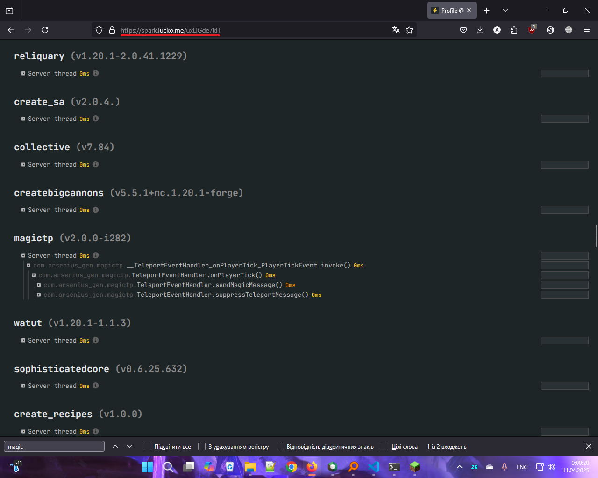

# MagicTP
A simple mod that changes /tp messages

## About
MagicTP was lightweight, chat feature thing that adds some "magic" for game that uses portals, teleportation or even - the ender pearls! Be sure that your server mates now can know your recent use of magic and exact location, or be like vanilla-flavoured pie feature - be anonymous, and moves with magic all around the world... like a trully wizard that covers the secret!

(the latest build does not include the "hide magic message from anyone" on server side, and the sync of server settings with client. Stay tuned for this feature!)

(about lightweightness: , you can check it out on [Spark](https://spark.lucko.me/uxLIGde7kH))

## The GUI
![The demonstration of the regular (vanilla) Minecraft message for the player that was moved ("_`[<Executer>: Teleported <player> to <coordinates>]`_")](https://cdn.modrinth.com/data/cached_images/de1b54383aaf43edbe4d69b2721584ce92aad89b.png)

The mod will replace boring vanilla Minecraft messages of teleportation to the beautiful "magic" messages that can include the player coordinates


## Dependencies

If player doesn't have mod installed, but the server has - the message in his chat will appear like 

```
[MC{some letters if server have share coordinates option on}]
{player} was moved by magic! To view more, install MagicTP from Modrinth
```

, where Modrinth are actually clickable, but if server doesn't have mod installed, but clients have it - the message like _`[<Executer>: Teleported <player> to <coordinates>]`_ will be hided for their chat

## Important Notes
Because of some specifics of the current code /tp handling, the mod requires to exists on the server side to work (for now)

Also, if you want to use mod on server - concider to use **`release v2.0.0`** instead latest **`beta v2.0.0`**, because latest betas **may have untested server compatibility** (with modpacks also)


## Known issues:
For the latest **stable**, **release** build, there are known issues:
- **no issues!**

Please consider to check the **`DEVLOG.md`** as the source of known issues and upcoming (& changelog) changes

Please consider to use compiled builds instead using source code to build. The source code may **sometimes** not work at all
